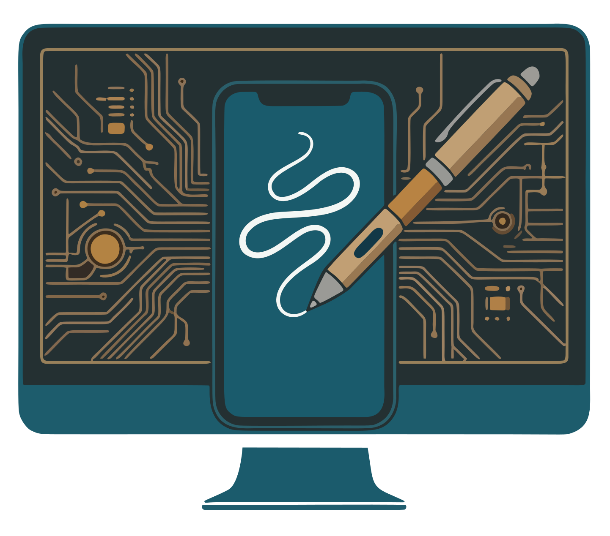

<div align="center">
  
  <h1>AStream</h1>

  <a href="https://github.com/tanq16/astream/actions/workflows/release.yml"></a>&nbsp;<a href="https://github.com/tanq16/astream/releases"></a>&nbsp;<a href="https://hub.docker.com/r/tanq16/astream"></a><br><br>
</div>

`AStream` is a lightweight Android app and server combo to allow screen sharing from an android device to a LAN server via WebSockets. I needed this to share handwritten drawboards from my tablet without issues. Existing solutions were either sluggish, consumed more bandwidth, relied heavily on background services (can be aggressively limited by android), or weren't stable.

## Features

- Simple Android app with foreground service to share screen in HD quality
- Efficient websocket H.264 stream for low-latency and bandwidth
- Simple web viewer that works on any device (via browser) in LAN

## Usage

#### Docker

```bash
docker run --rm -d --name astream -p 8080:8080 tanq16/astream:main
```

Docker Compose example:

```yaml
services:
  astream:
    image: tanq16/astream:main
    container_name: astream
    ports:
      - 8080:8080
```

#### Binary

Download the latest release and run with:

```bash
./astream
```

The server will start on port 8080

### Android App

Download the APK from the [releases page](https://github.com/tanq16/astream/releases) and install it. Grant screen capture permission when prompted and enter your server IP address (e.g., `ws://192.168.1.100:8080/publish` or `wss://astream.YOUR.DOMAIN/publish`) to start sharing your screen.

To view the stream, visit at `http://192.168.1.100:8080` or `https://astream.YOUR.DOMAIN` from any device on the network.

## Build

#### Android App

```bash
git clone https://github.com/tanq16/astream && cd astream/android && \
./gradlew assembleDebug
```

The APK will be generated at `app/build/outputs/apk/debug/app-debug.apk`.

#### Server

```bash
cd astream/server && go build .
# OR
go install github.com/tanq16/astream/server@latest
```
